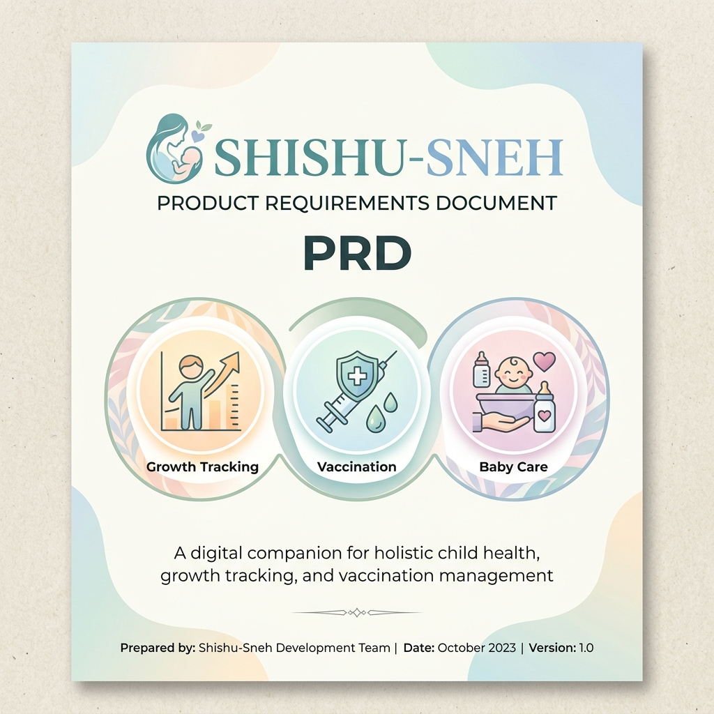

# Product Requirements Document (PRD): Shishu-Sneh Lite

## 1. Project Overview
**Product Name:** Shishu-Sneh Lite  
**Version:** 1.0.0  
**Tagline:** "Your Digital Elder for the First Vital Year"

### 1.1 Goal
To provide new mothers with a minimalist, high-reliability tool to track their baby's growth, manage vaccinations, and access critical nutritional guidance without the need for constant internet connectivity.

---

## 2. Problem Statement
New mothers, particularly in rural or underserved areas, often face:
- **Early Cessation of Breastfeeding**: Due to myths or lack of guidance.
- **Missed Vaccinations**: Lack of a simple, personalized tracking system.
- **Growth Monitoring Gaps**: Difficulty in tracking monthly weight gain and developmental milestones once they leave the hospital.

---

## 3. Target Audience
- **Primary**: New mothers (0-12 months postpartum).
- **Secondary**: ASHA workers and community healthcare providers assisting rural families.

---

## 4. Functional Requirements

### 4.1 Growth Tracker (📊)
- **FR1**: Users must be able to input weight in kg via a decimal numeric keypad.
- **FR2**: System shall visualize weight trends using an animated Line Chart (Cubic Bezier).
- **FR3**: Data must be persisted locally using Room Database.

### 4.2 Interactive Immunization (💉)
- **FR4**: System shall prompt for the baby's birth date to generate a personalized schedule.
- **FR5**: Users must be able to toggle vaccination status (Completed/Pending).
- **FR6**: System shall display a real-time progress bar for total vaccines completed.
- **FR7**: System must provide "Disease it prevents" information for each vaccine.

### 4.3 Care Hub (🥗 & ✅)
- **FR8**: Provide static nutritional tips for babies aged 0-6 months and 6-12 months.
- **FR9**: Provide nutritional advice for the breastfeeding mother.
- **FR10**: Interactive checklist for 10+ developmental milestones (Physical, Social, Communication).

---

## 5. Technical Requirements
- **Platform**: Android (Min SDK 24, Target SDK 34).
- **Architecture**: MVVM with Unidirectional Data Flow.
- **Persistence**: Room Database (Version 2 with Destructive Migration support).
- **UI Framework**: Jetpack Compose (Material 3).
- **Build System**: Gradle 8.5, Java 21, KSP.

---

## 6. UI/UX Design Principles
- **Aesthetics**: Calming pastel color palette (Pink, Blue, Mint).
- **Simplicity**: No complex forms; one-handed operation priority.
- **Reliability**: Offline-first design ensuring the app works without data.
- **Feedback**: Immediate visual confirmation for every user action (e.g., toggling a milestone).

---

## 7. Future Roadmap
- **v1.1**: Push notifications for upcoming vaccination dates.
- **v1.2**: Multi-baby profile support.
- **v1.3**: Community forum or ASHA worker chat integration.